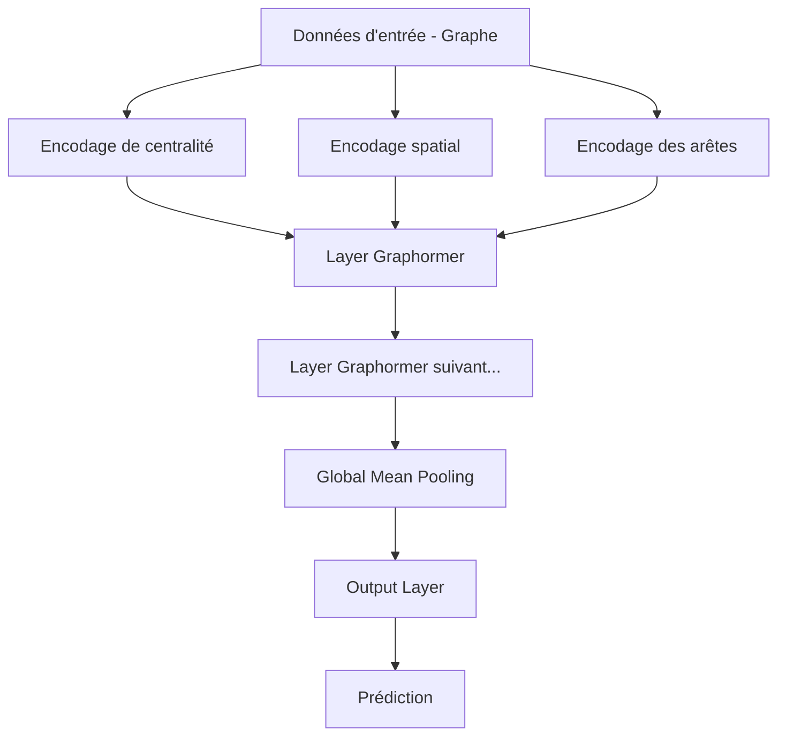

# Graphormer-Project

Une implémentation PyTorch de l'architecture Graphormer pour l'apprentissage sur des graphes, spécialisée pour la prédiction de propriétés moléculaires.


## 👋 Table des matières

- [Introduction](#introduction)
- [Architecture](#architecture)
- [Installation](#installation)
- [Utilisation](#utilisation)
- [Structure du projet](#structure-du-projet)
- [Résultats](#résultats)
- [Références](#références)
- [Licence](#licence)

## 🔍 Introduction

Graphormer est une architecture de transformeur adaptée aux données de graphes, introduisant plusieurs encodages spécifiques pour capturer efficacement la structure des graphes. Cette implémentation est spécialisée pour la prédiction de propriétés moléculaires en utilisant le dataset ESOL (prédiction de solubilité aqueuse).
- Elle est basée sur le papier ["Do Transformers Really Perform Bad for Graph Representation?"](https://ar5iv.labs.arxiv.org/html/2106.05234).

### Caractéristiques principales

- **Encodage de centralité** - Intégration de l'importance des nœuds basée sur les degrés entrants et sortants
- **Encodage spatial** - Capture de la distance structurelle entre les nœuds
- **Encodage des arêtes** - Intégration de l'information des arêtes dans l'attention
- **Multi-head attention** - Attention à plusieurs têtes adaptée aux graphes

## 🏰 Architecture

L'architecture Graphormer étend le modèle Transformeur aux données de graphes en intégrant la structure du graphe dans le mécanisme d'attention.



### Composants clés

1. **CentralityEncoding** - Capture l'importance des nœuds basée sur leur degré
2. **SpatialEncoding** - Encode la distance structurelle entre les nœuds
3. **EdgeEncoding** - Intègre l'information des arêtes
4. **GraphormerAttentionHead** - Mécanisme d'attention adapté aux graphes
5. **GraphormerMultiHeadAttention** - Attention à plusieurs têtes
6. **GraphormerEncoderLayer** - Couche complète du Graphormer

## 💻 Installation

### Prérequis

- Python 3.8+
- PyTorch 1.9+
- PyTorch Geometric
- NetworkX
- tqdm
- texttable

### Installation des dépendances

```bash
# Créer un environnement virtuel
python -m venv venv
source venv/bin/activate  # Sur Windows: venv\Scripts\activate

# Installer PyTorch (vérifier la compatibilité avec votre CUDA)
pip install torch

# Installer PyTorch Geometric
pip install torch-geometric

# Autres dépendances
pip install networkx tqdm texttable scikit-learn
```

## 🚀 Utilisation

### Entraînement du modèle

```bash
python main.py --exp_name "Exp1" --epochs 100 --lr 0.0005 --num_layers 1 --node_dim 128 --edge_dim 128 --num_heads 4
```

### Options principales

| Paramètre | Description | Valeur par défaut |
|-----------|-------------|-------------------|
| `--exp_name` | Nom de l'expérience | Exp |
| `--train_batch_size` | Taille du batch d'entraînement | 64 |
| `--test_batch_size` | Taille du batch de test | 64 |
| `--gpu_index` | Index GPU (négatif pour CPU) | 0 |
| `--epochs` | Nombre d'époques | 100 |
| `--lr` | Taux d'apprentissage | 0.0005 |
| `--num_layers` | Nombre de couches Graphormer | 1 |
| `--node_dim` | Dimension des features des nœuds | 128 |
| `--edge_dim` | Dimension des features des arêtes | 128 |
| `--num_heads` | Nombre de têtes d'attention | 4 |
| `--max_path_distance` | Distance maximale entre deux nœuds | 5 |

## 📝 Structure du projet

```
graphormer/
│
├── data.py           # Chargement et prétraitement des données
├── layer.py          # Définition des couches Graphormer
├── main.py           # Script principal d'entraînement et d'évaluation
├── model.py          # Définition du modèle Graphormer complet
├── parameter.py      # Gestion des paramètres et configuration

```

## 📊 Résultats

### Performance sur le dataset ESOL

| Métrique | Valeur |
|----------|--------|
| MAE (test) | 0.964814 |

#### Temps d'entraînement

L'entraînement complet a pris environ 7 heures sur un GPU standard, avec les temps moyens suivants par batch:
- Début d'entraînement: ~21-27 it/s
- Milieu d'entraînement: ~28-30 it/s
- Fin d'entraînement: ~27-30 it/s

La métrique MAE (Mean Absolute Error) finale sur l'ensemble de test indique que notre modèle prédit les valeurs de solubilité avec une précision raisonnable pour le dataset ESOL.

### Progression de l'entraînement

Le modèle a été entraîné pendant 100 époques. Voici un extrait des logs d'entraînement montrant la progression de l'erreur:


## Note sur le dataset utilisé

⚠️ **Important :** L'article original "Do Transformers Really Perform Bad for Graph Representation?" évalue l'architecture Graphormer sur plusieurs datasets, notamment PCQM4M, MolPCBA et d'autres benchmarks importants. Notre implémentation se concentre uniquement sur le dataset ESOL (solubilité aqueuse) en raison de contraintes de ressources computationnelles.

Ces datasets de l'article original sont considérablement plus volumineux et nécessitent des ressources GPU importantes pour l'entraînement, ce qui n'était pas disponible dans notre environnement de développement. Le dataset ESOL a été choisi comme alternative viable car:

1. Sa taille est plus adaptée aux ressources disponibles
2. Il permet tout de même de démontrer l'efficacité de l'architecture Graphormer

Cette adaptation nous a permis d'implémenter et de tester les concepts clés de l'architecture Graphormer (encodage de centralité, encodage spatial, encodage des arêtes) dans un contexte pratique, tout en obtenant des résultats significatifs sur la tâche de prédiction de solubilité.

## 📚 Références

- [Paper original Graphormer](https://ar5iv.labs.arxiv.org/html/2106.05234)
- [PyTorch Geometric](https://pytorch-geometric.readthedocs.io/)
- [MoleculeNet](https://moleculenet.org/)
  

## 📄 Licence

Ce projet est sous licence MIT - voir le fichier LICENSE pour plus de détails.
